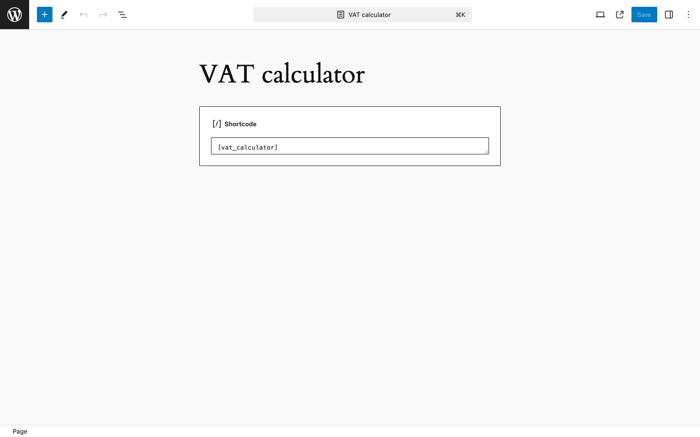
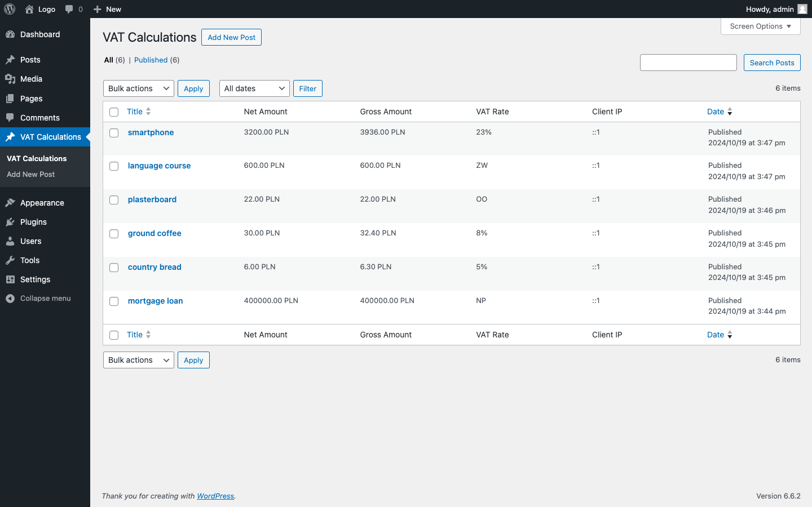
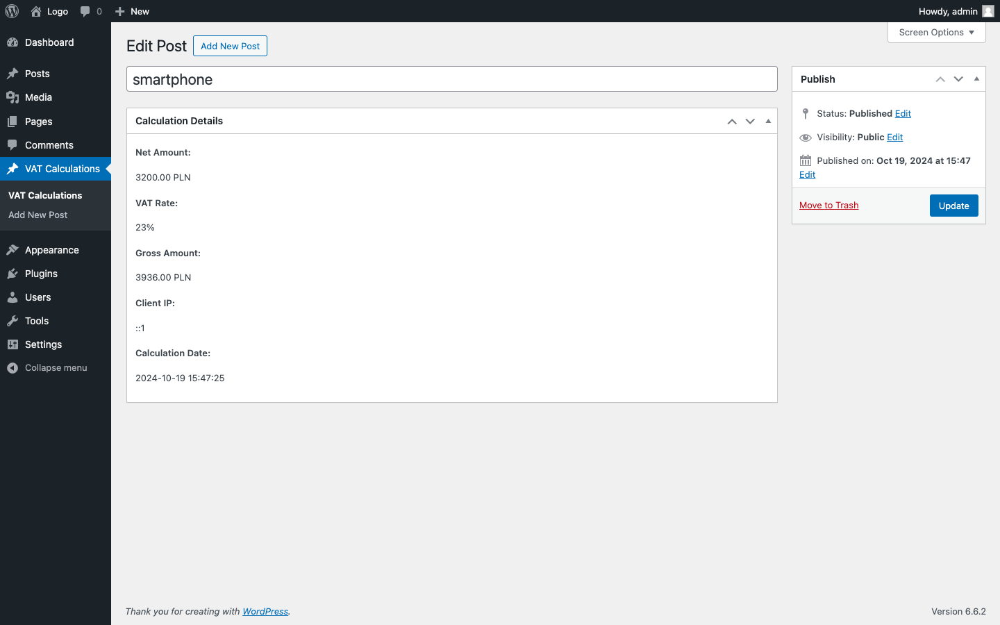

# VAT Calculator Plugin

WordPress plugin for calculating VAT on products. This plugin allows you to enter product details, including the net amount and VAT rate, and then calculate the gross amount and tax value. Additionally, each calculation is saved in a Custom Post Type.

## Features

- User-friendly form for entering product information.
- Supports multiple VAT rates.
- Displays calculated gross amount and tax value.
- Saves calculation details to a custom post type.

## Installation

1. Upload the `vat-calculator` folder to the `/wp-content/plugins/` directory.
2. Activate the plugin through the 'Plugins' menu in WordPress.
3. Use the shortcode `[vat_calculator]` to display the VAT calculator form on your desired page or post.

## Usage

Once activated, you can use the VAT calculator by adding the shortcode `[vat_calculator]` to any post or page. The form will allow users to enter:

- Product Name
- Net Amount (in PLN)
- VAT Rate
- Currency (default: PLN)

Upon submission, the calculated gross amount and tax amount will be displayed. Additionally, users can check the calculation details in the custom post type "VAT Calculations" after submitting the form.

## Translation

The plugin supports multiple languages. To add translations, place your `.mo` and `.po` files in the `languages` directory. The plugin currently includes Polish (PL) and English (US) translations.

## Screenshots

### 1. Adding Shortcode View

### 2. View of the Added Form

### 3. View of Saved Calculations

### 4. Single Enum View

